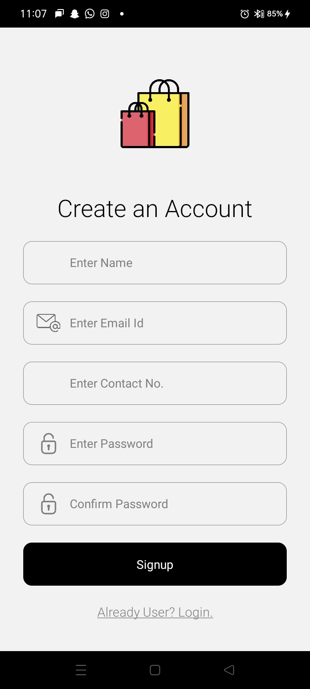
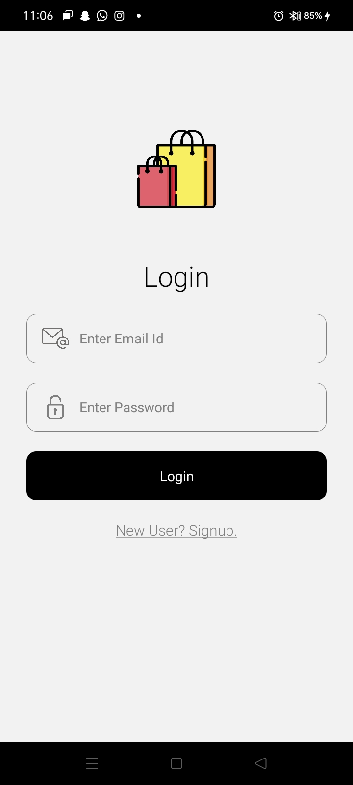
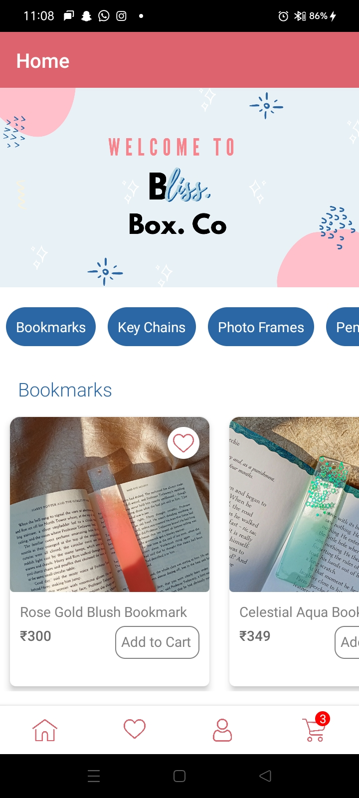
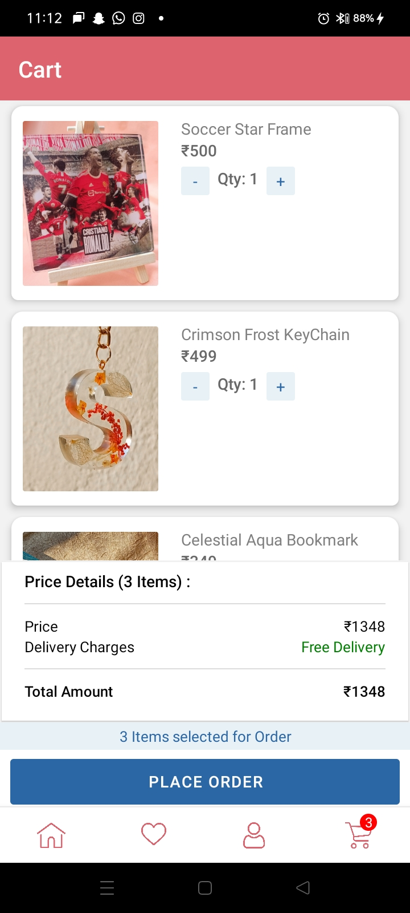

# BlissBox: E-Com App

The BlissBox Co. an E-commerce App, built with React Native and powered by Redux Toolkit for state management, revolutionizes the shopping experience for our handcrafted resin gift accessories.

## Built With:

- React Native
- Redux ToolKit
- HTML,CSS

## Screenshots

<h3>Signup:</h3>
    
<h3>Login:</h3>
  
<h3>Home:</h3>
  
<h3>Cart:</h3>
  

In the project directory, you can run:
### `npm start`

Runs the app in the development mode.\
Open [http://localhost:3000](http://localhost:3000) to view it in your browser.

The page will reload when you make changes.\
You may also see any lint errors in the console.

